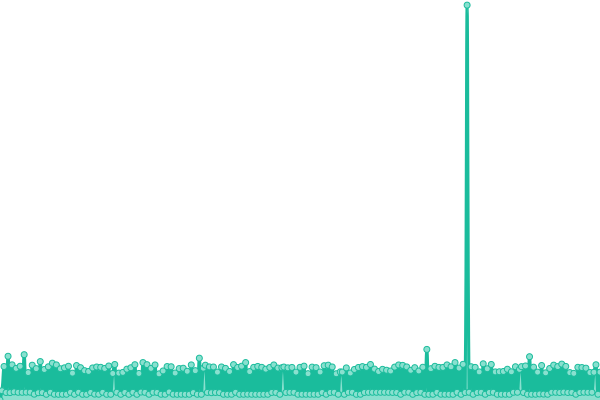
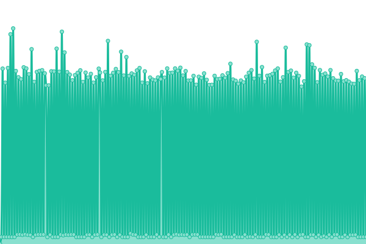

# [📈 Live Status](https://traqy.github.io/upptime): <!--live status--> **🟩 All systems operational**

This repository contains the open-source uptime monitor and status page for [Bernard Traquena](https://www.techinasia.com), powered by [Upptime](https://github.com/upptime/upptime).

With [Upptime](https://upptime.js.org), you can get your own unlimited and free uptime monitor and status page, powered entirely by a GitHub repository. We use [Issues](https://github.com/traqy/upptime/issues) as incident reports, [Actions](https://github.com/traqy/upptime/actions) as uptime monitors, and [Pages](https://traqy.github.io/upptime) for the status page.

<!--start: status pages-->
<!-- This summary is generated by Upptime (https://github.com/upptime/upptime) -->
<!-- Do not edit this manually, your changes will be overwritten -->
<!-- prettier-ignore -->
| URL | Status | History | Response Time | Uptime |
| --- | ------ | ------- | ------------- | ------ |
|  [TechinAsia](https://www.techinasia.com) | 🟩 Up | [techin-asia.yml](https://github.com/traqy/upptime/commits/HEAD/history/techin-asia.yml) | 

 1332ms
     
 | 

<a href="https://traqy.github.io/upptime/history/techin-asia">98.21%</a>
    

|  [TechinAsia_WordPress_API](https://www.techinasia.com/wp-json/techinasia/2.0/posts) | 🟩 Up | [techin-asia-word-press-api.yml](https://github.com/traqy/upptime/commits/HEAD/history/techin-asia-word-press-api.yml) | 

 621ms
     
 | 

<a href="https://traqy.github.io/upptime/history/techin-asia-word-press-api">98.21%</a>
    

|  [TechinAsia_Laravel_API](https://www.techinasia.com/api/2.0/companies) | 🟩 Up | [techin-asia-laravel-api.yml](https://github.com/traqy/upptime/commits/HEAD/history/techin-asia-laravel-api.yml) | 

 2071ms
     
 | 

<a href="https://traqy.github.io/upptime/history/techin-asia-laravel-api">98.20%</a>
    

|  [TechinAsia_Conference](https://conference.techinasia.com) | 🟩 Up | [techin-asia-conference.yml](https://github.com/traqy/upptime/commits/HEAD/history/techin-asia-conference.yml) | 

 4453ms
     
 | 

<a href="https://traqy.github.io/upptime/history/techin-asia-conference">100.00%</a>
    

|  [TechinAsia_PDC](https://pdc.techinasia.com) | 🟩 Up | [techin-asia-pdc.yml](https://github.com/traqy/upptime/commits/HEAD/history/techin-asia-pdc.yml) | 

 1977ms
     
 | 

<a href="https://traqy.github.io/upptime/history/techin-asia-pdc">100.00%</a>
    

|  [TechinAsia_Advertise](https://advertise.techinasia.com) | 🟩 Up | [techin-asia-advertise.yml](https://github.com/traqy/upptime/commits/HEAD/history/techin-asia-advertise.yml) | 

 2013ms
     
 | 

<a href="https://traqy.github.io/upptime/history/techin-asia-advertise">100.00%</a>
    

|  [TechinAsia_Sync](https://sync.techinasia.com) | 🟩 Up | [techin-asia-sync.yml](https://github.com/traqy/upptime/commits/HEAD/history/techin-asia-sync.yml) | 

 1787ms
     
 | 

<a href="https://traqy.github.io/upptime/history/techin-asia-sync">100.00%</a>
    

|  [TechinAsia_AWS](https://aws.techinasia.com) | 🟩 Up | [techin-asia-aws.yml](https://github.com/traqy/upptime/commits/HEAD/history/techin-asia-aws.yml) | 

 1421ms
     
 | 

<a href="https://traqy.github.io/upptime/history/techin-asia-aws">100.00%</a>
    

|  [TechinAsia_Saigon](https://saigon.techinasia.com) | 🟩 Up | [techin-asia-saigon.yml](https://github.com/traqy/upptime/commits/HEAD/history/techin-asia-saigon.yml) | 

 1937ms
     
 | 

<a href="https://traqy.github.io/upptime/history/techin-asia-saigon">100.00%</a>
    

<!--end: status pages-->

[**Visit our status website →**](https://traqy.github.io/upptime)

## 📄 License

- Powered by: [Upptime](https://github.com/upptime/upptime)
- Code: [MIT](./LICENSE) © [Bernard Traquena](https://www.techinasia.com)
- Data in the `./history` directory: [Open Database License](https://opendatacommons.org/licenses/odbl/1-0/)
